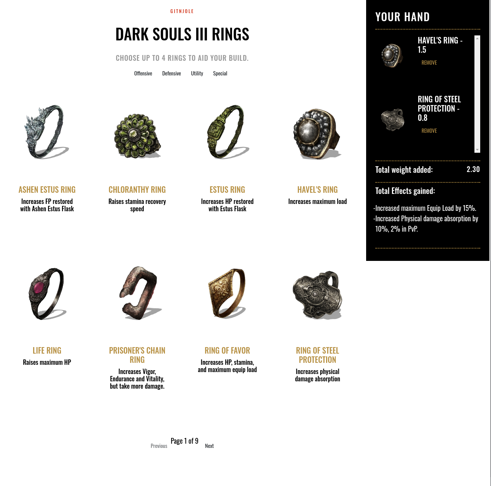

# souls-shop

<p align="center">


</p> 

## What is souls-shop

A project developed to explore JavaScript and Vue.js fundamentals. I focused on data binding and reactivity.

Check out a live demo on [netlify](https://guileless-dasik-332911.netlify.app/)

## Installation

Clone this project
```bash
git clone https://github.com/gitnjole/souls-shop
```

## Usage

All ring data is located in the directory `assets\json` where you can update or change information.

Only 4 (four) rings can be selected at a time. Clicking on the button `add to hand` will update the right-hand bar with selected ring's benefits along with weight.

You can use the category tags to filter rings and navigate pages. Will implement search function in near future.


# TODO

- [x] Add all rings
- [ ] Implement shuffle button
- [ ] Implement search
- [ ] Implement JSON export
- [x] Implement total effect calculator
- [x] Implement maximum of 4 rings
- [x] Implement better data storage solution
- [ ] **(partially implemented)** Implement +1/+2/+3 versions of rings
- [ ] Add better button CSS to display max ring limit
- [ ] Change 'cart' and 'menu' naming convention

# Known Issues

The max limit button isn't enforced correctly.

The layout isn't dynamic, so mobile and vertical monitor users might not get the best experience.

# View

