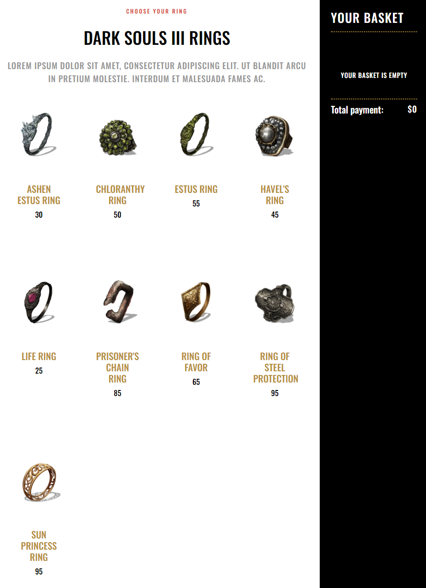

# Introduction

WIP - check back later!

# TODO

- [ ] Add all rings
- [x] Implement total effect calculator
- [x] Implement maximum of 4 rings
- [ ] Finish README
- [ ] Implement better data storage solution
- [ ] Implement +1/+2/+3 versions of rings

# View

